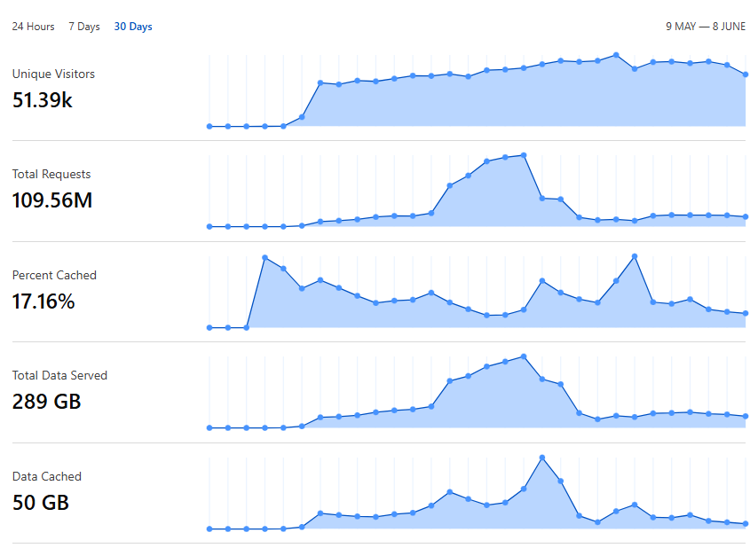

This repository has a goal of spreading the word about real **BIG** projects built with PHP/Laravel. 

I will share what I find online and on social media, you can contribute with links, just put it in a Pull Request, and I will think how exactly to put it into the repo.

I'm still not sure about the **structure** of this repository. For now, it's all in one README. Depending on the amount of links/posts, I may re-group it somehow or even create a separate website with showcase.

---

## Social Media Posts

[Srinath Reddy on X](https://x.com/srinathdudi/status/1983912143457046822): 

> We are currently doing 30M / month on app built using laravel.

---

[John O'Nolan on X](https://x.com/JohnONolan/status/1983600289396748297):

> Doing ~12M req/mo now on my laravel app on Laravel Cloud - which powers [explore.ghost.org](https://explore.ghost.org) (the public front end is very simple, the back end is much more extensive).

---

[Jake Casto on X](https://x.com/0x15f/status/1728172957619617829):

> Almost 100,000,000 reqs in 24 hours and people say Laravel can't scale

---

[Alam Lam on X](https://x.com/extralam/status/1983915915369705815):

> ~80M req/mo now on laravel app - which powers one of our client project. The public front end by Livewire, app by 
React Native, the backend by Filament. Our server using Azure App Services with Redis and MySQL.

---

[Jonty Behr on X](https://x.com/jontybehr/status/1811316493906317636):

> We're handling ~230m requests per month (~88 rps) on Laravel across 3 linked sites. Original codebase was written in Laravel 4, but has been upgraded along the way, and now on L11. Monoliths, fully tested, strong typehints.

[Al Kafi on LinkedIn](https://www.linkedin.com/in/al-kafi-sohag/):

> Our high-performance web application, built with Laravel 12 backend and Blade + Tailwind CSS frontend, handles 109M+ requests monthly.

---

## More In-Depth Stories/Articles

[Jack Ellis from Fathom Analytics: Does Laravel Scale?](https://usefathom.com/blog/does-laravel-scale)

Awesome long article based on the story of Fathom who run Laravel on infrastructure that can handle over 157 billion requests per month (*data from 2022*). For large projects, Laravel will NOT be the main bottleneck.

---

[Mathias Hansen: How Geocodio keeps 300M addresses up to date](https://www.geocod.io/code-and-coordinates/2025-01-13-how-geocodio-keeps-300M-addresses-up-to-date/)

Their entire platform is built on Laravel and uses Laravel Nova. They also make heavy use of queueing using Laravel Horizon.

---

[Mateus Guimarães: Scaling Laravel to 100M+ jobs and 30,000 requests/sec](https://mateusguimaraes.com/posts/scaling-laravel)

How they scaled to over a hundred million jobs and peaks of 30,000 requests/minute a timespan of only twelve hours, using nothing but Laravel, MySQL and Redis.

---

[Redberry: From 0 to 150K Visitors in 4 Hours: Scaling a Real-Time Engagement Platform](https://laravel.com/blog/from-0-to-150k-visitors-in-4-hours-scaling-a-real-time-engagement-platform)

When 150K users flooded a web platform in just 4 hours, with no ramp-up, no downtime, and real-time interaction required, Redberry made it possible using Laravel Cloud, Filament, PostgreSQL, and Pusher. A story from official Laravel Blog.

---

[Matthew Davis: The Power Behind Mumsnet, the UK’s No. 1 Platform for Parents](https://tighten.com/insights/bol-ep7-matthew-davis-mumsnet/)

Business of Laravel Podcast interview with Matt Stauffer from Tighten, they discuss Mumsnet's full-scale transition to Laravel, unpacking the challenges and victories of their ground-up rewrite.

---

[Galahad Creative: From Zero to 35M: The struggles of scaling Laravel with Octane](https://www.galahadsixteen.com/blog/from-zero-to-35m-the-struggles-of-scaling-laravel-with-octane)

The remarkable success of Laravel Octane in our project can be largely credited to its foundation on Swoole, a high-performance, coroutine-based PHP framework. 

---

[Behind the scenes of Lemon Squeezy with Gilbert Pellegrom](https://www.lemonsqueezy.com/blog/lemonhead-gilbert-pellegrom)

Lemon Squeezy payment provider (*later acquired by Stripe*) was built entirely using Laravel and Vue. PHP gets a lot of hate but the language has come a long way in the last ten years and Laravel really makes it a joy to work with.

---

[Arvid Kahl: One Year of Podscan.fm: Reflecting on Tech & Business Decisions](https://thebootstrappedfounder.com/one-year-of-podscan-reflecting-on-tech-business-decisions/)

A podcast episode where Arvid says that the biggest choice he made at the beginning of Podscan was to build this product with the Laravel framework. As of April 2025, Podscan is somewhere north of five to six terabytes in raw storage.

---

## Lists of Projects Built with Laravel/PHP

- [Tighten: Built with Laravel: A curated catalog of organizations using Laravel](https://builtwithlaravel.com/)
- [Laravel Daily: 10 Large Open-Source Projects Built with Laravel](https://laraveldaily.com/post/large-laravel-open-source-projects)
- [KrishaWeb: Best Use Cases for Custom Laravel Web Development In 2025](https://www.krishaweb.com/blog/best-laravel-web-development-use-cases-to-explore/)

---

You know more stories about Laravel/PHP in bigger projects? Contribute a Pull Request or email me povilas@laraveldaily.com